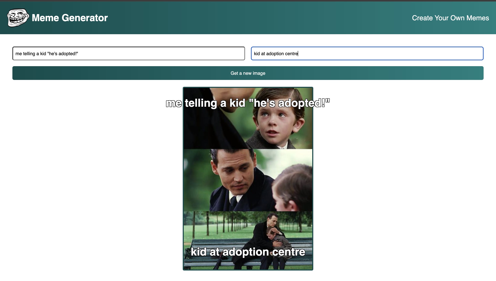

# MemeWiz

MemeWiz is a dynamic website built using React.js that allows users to create custom memes. Users can select from a variety of popular meme templates and add their own top and bottom text to personalize the memes.

## Features

- **Dynamic Meme Templates**: Access a collection of popular meme templates via an API.
- **Customizable Text**: Add custom top and bottom text to the selected meme template.
- **React Concepts**: Utilizes React.js features such as `useState` and `useEffect`, forms, conditional rendering, and controlled inputs.

## Tech Stack

- **React.js**: Frontend library for building user interfaces.
- **HTML/CSS**: Markup and styling.
- **API**: Fetch meme templates from an external API.

## Key React Concepts Used
- **useState**: Manage state for the meme templates and user inputs.
- **useEffect**: Fetch meme templates from an API when the component mounts.
- **Forms**: Handle user inputs for customizing meme text.
- **Conditional Rendering**: Display different components based on the application state.
- **Controlled Inputs**: Synchronize user input fields with the component state.

 ## Installation

1. Clone the repository:
   git clone https://github.com/ArshitaKango/MemeWiz.git
   
2. Navigate to the project directory:
   cd MemeWiz

3. Install dependencies:
   npm install

4. Start the development server:
   npm start

